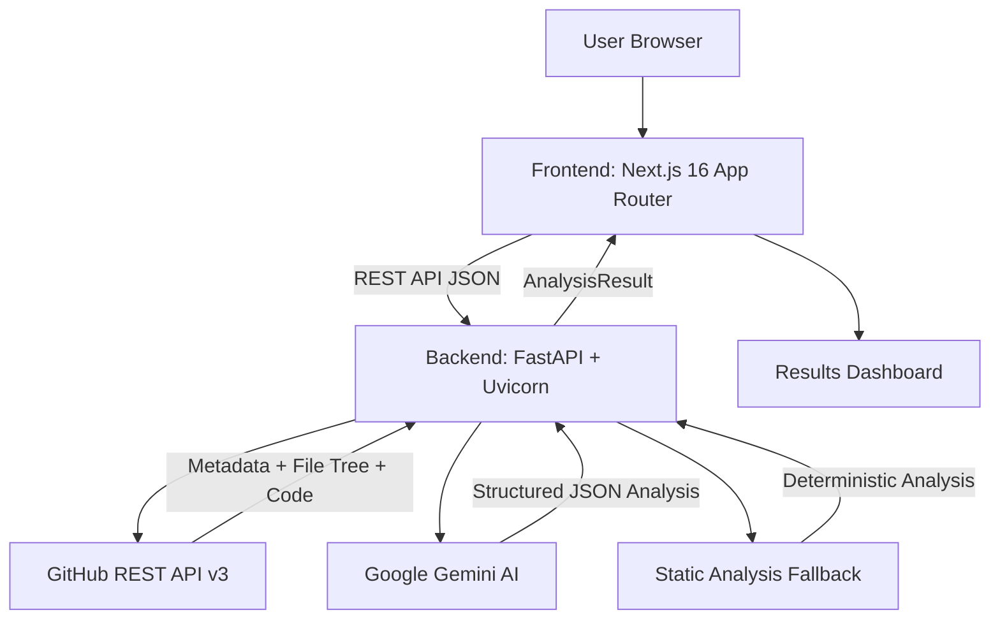
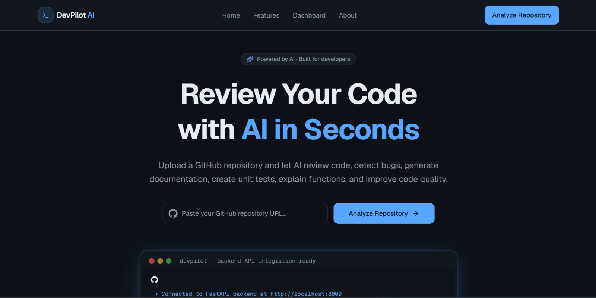
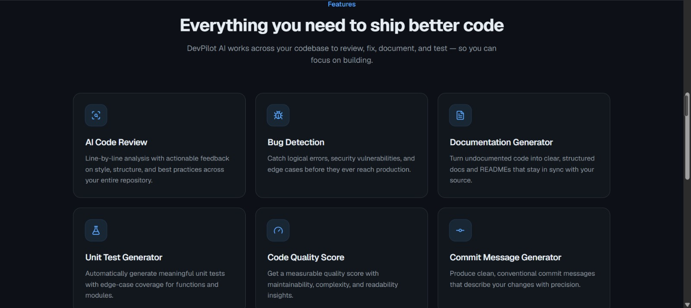
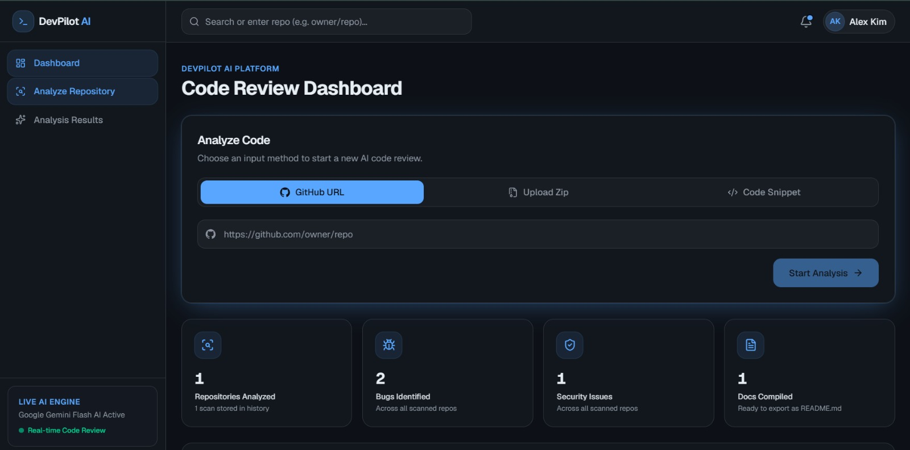
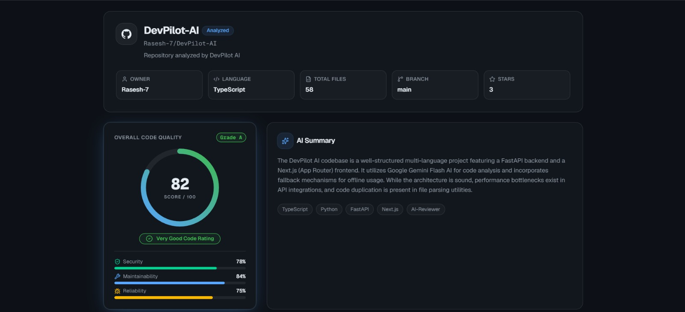

# DevPilot AI

VERCEL DEPLOYED LINK:-https://dev-pilot-ai-three.vercel.app/

[](https://github.com/Rasesh-7/DevPilot-AI/actions/workflows/ci.yml)

DevPilot AI is an AI-powered developer productivity platform that analyzes GitHub repositories, uploaded zip archives, and code snippets to detect bugs, identify security vulnerabilities, locate code smells, suggest performance improvements, recommend unit tests, and generate developer documentation — all through a modern web dashboard.

> **Hackathon**: Deploy or Die — HowToAlgo x GDG on Campus KIIT
>
> **Track**: Track B — Developer Productivity Tools

---

## Problem Statement

- **Code review is slow and manual.** Developers spend significant time inspecting pull requests, scanning for null dereferences, catching unhandled exceptions, and verifying security hygiene.
- **Unfamiliar codebases are hard to navigate.** Joining a new project or evaluating an open-source library requires understanding architecture, file roles, and setup procedures — context that is rarely documented well.
- **Bugs hide in plain sight.** Array out-of-bounds errors, heap buffer overflows, hardcoded secrets, and resource leaks often slip past human reviewers.
- **DevPilot AI aims to make these tasks faster using AI** while keeping the developer in full control of the review process and the final decision.

---

## Solution

DevPilot AI provides an end-to-end automated code review workflow:

1. **Developer provides input** — a public GitHub repository URL, a `.zip` archive upload, or a raw code snippet.
2. **Repository analysis** — the backend fetches metadata, file trees, and sampled source code via the GitHub REST API (or extracts files from the zip/snippet).
3. **AI-powered review** — a structured prompt is sent to Google Gemini Flash models. A deterministic fallback engine activates automatically if the AI service is unavailable.
4. **Structured results** — findings are classified into Bugs, Security Issues, Code Smells, Performance Suggestions, Test Suggestions, Commit Messages, and a Developer Guide.
5. **Dashboard presentation** — the frontend renders an animated quality score gauge, severity-tagged issue cards, and a formatted Markdown documentation viewer with copy and export functionality.

---

## Features

- **GitHub Repository Analysis** — paste any public GitHub URL to trigger a full AI code review.
- **Zip Archive Upload** — drag-and-drop `.zip` files (up to 10 MB) containing source code.
- **Code Snippet Review** — paste code directly with language auto-detection or manual selection.
- **Quality Score Gauge** — animated 0–100 score with letter grade (A+ to F) and breakdown metrics for Security, Maintainability, and Reliability.
- **Bug Detection** — identifies null dereferences, array out-of-bounds, heap buffer overflows, off-by-one errors, and incorrect recursion base cases.
- **Security Vulnerability Scanning** — flags unsanitized inputs, hardcoded secrets, and dependency risks.
- **Code Smell Detection** — highlights duplicated blocks, long functions, deep nesting, magic numbers, and unused code.
- **Performance Suggestions** — recommends caching strategies, memory allocation optimizations, and async improvements.
- **Unit Test Suggestions** — proposes test scenarios and edge cases for critical functions.
- **Commit Message Generation** — generates conventional commit messages based on detected issues.
- **Developer Guide Generation** — produces structured Markdown documentation with Executive Summary, Architecture, File Map, and Quick Start sections.
- **JSON Export** — download the full analysis report as a `.json` file.
- **Review History** — persistent local history of the last 20 analyses with one-click re-inspection.
- **Multi-Model AI Fallback** — cascades through `gemini-3.5-flash`, `gemini-3.6-flash`, `gemini-flash-latest`, and `gemini-2.0-flash`, falling back to a deterministic static analysis engine when all API calls fail.
- **Resilient API Client** — the frontend tries `localhost` then `127.0.0.1` for local development reliability.

### Planned Features

- Interactive AI diff/fix generator per detected bug.
- GitHub Pull Request webhook integration for automated PR reviews.
- Multi-repository quality comparison and trend tracking.
- PDF export for the generated developer guide.

---

## Tech Stack

### Frontend

| Technology | Version | Purpose |
| :--- | :--- | :--- |
| Next.js (App Router) | 16.3.0 | React framework with file-based routing |
| React | 19 | UI component library |
| TypeScript | 5.7.3 | Type-safe JavaScript |
| Tailwind CSS | 4.3.3 | Utility-first CSS framework |
| Lucide React | 1.16.0 | Icon library |
| shadcn/ui | 4.8.0 | Pre-built accessible UI components |

### Backend

| Technology | Version | Purpose |
| :--- | :--- | :--- |
| Python | 3.13 | Runtime language |
| FastAPI | 0.116.1 | Async web framework |
| Uvicorn | 0.35.0 | ASGI server |
| Pydantic | 2.11.7 | Data validation and serialization |
| HTTPX | 0.28.1 | Async HTTP client for GitHub API |
| python-dotenv | 1.2.2 | Environment variable management |
| python-multipart | 0.0.9+ | File upload handling |

### AI

| Provider | Models |
| :--- | :--- |
| Google Gemini | `gemini-3.5-flash`, `gemini-3.6-flash`, `gemini-flash-latest`, `gemini-2.0-flash` |
| Fallback | Deterministic static analysis engine (regex-based pattern detection) |

### Testing

| Tool | Purpose |
| :--- | :--- |
| Python `unittest` | Backend unit tests (13 test cases) |
| FastAPI `TestClient` | API route integration tests |

### CI/CD

| Tool | Purpose |
| :--- | :--- |
| GitHub Actions | Automated backend tests and frontend build on push/PR to `main` |

---

## Architecture



**Data flow**: User submits input → Frontend sends request to FastAPI → Backend fetches repository data from GitHub API → Prompt is constructed and sent to Gemini → AI response is parsed and sanitized → Structured `AnalysisResult` is returned → Frontend renders the interactive dashboard.

For the complete system design, data models, and API endpoint documentation, see [`ARCHITECTURE.md`](./ARCHITECTURE.md).

---

## Project Structure

```text
DevPilot-AI/
├── frontend/                  # Next.js 16 App Router frontend
│   ├── app/                   # Page routes (/, /analyze, /dashboard, /results)
│   ├── components/            # React components (dashboard, results, analyze, UI)
│   ├── lib/                   # API client, types, and session storage helpers
│   ├── public/                # Static assets
│   ├── package.json           # Node.js dependencies
│   └── vercel.json            # Vercel deployment configuration
├── backend/                   # FastAPI Python backend
│   ├── app.py                 # FastAPI application entry point
│   ├── routes/                # API route handlers (analyze, upload, health)
│   ├── services/              # Core logic (ai_service, github_service, file_reader, prompt_builder)
│   ├── models/                # Pydantic request/response schemas
│   ├── utils/                 # Helper functions (URL parsing, file filtering)
│   ├── requirements.txt       # Python dependencies
│   └── .env.example           # Environment variable template
├── tests/                     # Backend unit tests
│   ├── test_api.py            # API route tests
│   ├── test_services.py       # Service layer tests
│   └── test_upload.py         # Zip and snippet upload tests
├── .agents/                   # Custom agent and skill definitions
│   ├── agents/
│   │   └── code-auditor.md    # Custom Agent: Code Auditor
│   └── skills/
│       └── code-reviewer/
│           └── SKILL.md       # Custom Skill: repository-reviewer
├── .github/
│   └── workflows/
│       └── ci.yml             # GitHub Actions CI/CD pipeline
├── render.yaml                # Render backend deployment blueprint
├── AGENTS.md                  # Agent constitution and behavioral rules
├── AGENTS_AND_SKILLS.md       # Agent and skill specification document
├── ARCHITECTURE.md            # System architecture and technical design
└── README.md                  # This file
```

---

## Getting Started

### Prerequisites

- **Python** 3.12 or 3.13
- **Node.js** 20+
- **npm** 10+
- **Git**

### Clone

```bash
git clone https://github.com/Rasesh-7/DevPilot-AI.git
cd DevPilot-AI
```

### Backend Setup

```bash
cd backend

# Create and activate a virtual environment
python -m venv venv
venv\Scripts\activate        # Windows
# source venv/bin/activate   # macOS / Linux

# Install dependencies
pip install -r requirements.txt

# Configure environment variables
copy .env.example .env       # Windows
# cp .env.example .env       # macOS / Linux
```

Edit the `.env` file and add your API keys:

```env
GEMINI_API_KEY=your_gemini_api_key_here
GITHUB_TOKEN=your_github_token_here
ALLOWED_ORIGINS=http://localhost:3000,http://127.0.0.1:3000
```

Start the backend server:

```bash
uvicorn app:app --reload --port 8000
```

### Frontend Setup

```bash
cd frontend

# Install dependencies
npm install --legacy-peer-deps

# Start the development server
npm run dev
```

### Running the Application

Once both servers are running:

| Service | URL |
| :--- | :--- |
| Frontend | `http://localhost:3000` |
| Backend | `http://localhost:8000` |
| API Docs (Swagger) | `http://localhost:8000/docs` |

---

## Environment Variables

### Backend (`backend/.env`)

```env
# Google Gemini API key (optional — without it, the app uses the static analysis fallback engine)
GEMINI_API_KEY=your_gemini_api_key_here

# GitHub personal access token (optional — increases rate limit from 60 to 5,000 req/hr)
GITHUB_TOKEN=your_github_token_here

# Allowed origins for CORS (comma-separated)
ALLOWED_ORIGINS=http://localhost:3000,http://127.0.0.1:3000
```

### Frontend (`frontend/.env.local`)

```env
NEXT_PUBLIC_API_URL=http://localhost:8000
```

---

## Testing

### Backend Unit Tests

Run the full backend test suite (13 test cases covering API routes, services, and upload endpoints):

```bash
cd DevPilot-AI
python -m unittest discover -s tests -p "test_*.py"
```

The test suite covers:

- **`test_api.py`** — Root endpoint, health check, URL validation, and full analysis flow.
- **`test_services.py`** — GitHub URL parsing, file type filtering, stats computation, prompt building, and dynamic AI analysis.
- **`test_upload.py`** — Zip archive upload, snippet analysis, empty code validation, and invalid file extension handling.

### Frontend Build Verification

```bash
cd frontend
npm run build
```

---

## CI/CD

The GitHub Actions workflow is defined at [`.github/workflows/ci.yml`](./.github/workflows/ci.yml).

It runs automatically on every push and pull request to the `main` branch and includes two jobs:

| Job | What It Does |
| :--- | :--- |
| **Backend Unit Tests** | Sets up Python 3.13, installs dependencies, runs `unittest discover` |
| **Frontend Build** | Sets up Node.js 20, installs dependencies, runs `npm run build` |

---

## Agent-Driven Development

DevPilot AI was developed using an agent-driven workflow with AI coding assistants. The agent behavioral rules — including empirical grounding, severity classification, and documentation standards — are codified in [`AGENTS.md`](./AGENTS.md).

---

## Custom Agents and Skills

### Custom Agent: Code Auditor

- **Location**: [`.agents/agents/code-auditor.md`](./.agents/agents/code-auditor.md)
- **Role**: Autonomous security and maintainability auditor for software repositories.
- **Assigned Skill**: `repository-reviewer`

### Custom Skill: repository-reviewer

- **Location**: [`.agents/skills/code-reviewer/SKILL.md`](./.agents/skills/code-reviewer/SKILL.md)
- **Description**: Specialized skill enabling agents to parse GitHub trees, sample source code files, detect bugs and smells, and build formatted developer documentation.

For full details, see [`AGENTS_AND_SKILLS.md`](./AGENTS_AND_SKILLS.md).

---

## Hackathon Entry Criteria

| # | Criterion | Status | Evidence |
| :--- | :--- | :--- | :--- |
| 1 | Architecture document | ✅ | [`ARCHITECTURE.md`](./ARCHITECTURE.md) |
| 2 | Agent rules | ✅ | [`AGENTS.md`](./AGENTS.md) |
| 3 | Working code | ✅ | Backend (13/13 tests pass), Frontend (production build succeeds) |
| 4 | Custom agent and custom skill | ✅ | [`AGENTS_AND_SKILLS.md`](./AGENTS_AND_SKILLS.md) |
| 5 | Green CI/CD pipeline | ✅ | [`.github/workflows/ci.yml`](./.github/workflows/ci.yml) |

---

## Development Status

### Completed

- [x] FastAPI backend with `/analyze`, `/analyze/zip`, and `/analyze/snippet` endpoints
- [x] GitHub REST API integration (metadata, file tree, code fetching)
- [x] Google Gemini AI integration with multi-model fallback chain
- [x] Deterministic static analysis fallback engine
- [x] Pydantic request/response models with validation
- [x] Next.js frontend with landing page, dashboard, analysis loader, and results page
- [x] Multi-input support (GitHub URL, Zip upload, Code snippet)
- [x] Animated quality score gauge with letter grades
- [x] Bug, Security, Code Smell, Performance, and Test suggestion cards
- [x] Commit message generation
- [x] Developer guide generation with Markdown renderer
- [x] JSON export of analysis reports
- [x] Persistent review history (localStorage, 20 items)
- [x] Backend unit test suite (13 tests)
- [x] GitHub Actions CI/CD pipeline
- [x] Vercel frontend deployment configuration
- [x] Render backend deployment configuration
- [x] Custom Agent (`Code Auditor`) and Custom Skill (`repository-reviewer`)
- [x] Architecture documentation

### Planned

- [ ] Interactive AI diff/fix generator per detected bug
- [ ] GitHub PR webhook integration for automated reviews
- [ ] Multi-repository quality comparison dashboard
- [ ] PDF export for developer guides
- [ ] Secret and credential scanning shield

---

## Team

| Member | Role | Responsibilities |
| :--- | :--- | :--- |
| Snehankita Dey | Frontend Lead | Frontend UI, dashboard, and results page |
| Ashmit Roy | Backend & AI Lead | FastAPI, repository analysis, AI integration |
| Rasesh Bose | DevOps & QA Lead | CI/CD, testing, documentation, deployment |

---

## Demo

- **Demo video**: https://drive.google.com/file/d/1V_OXWcWaaX-KFoI6db0edeH9_Nnf4fu8/view?usp=drivesdk
- **Live application**: https://dev-pilot-ai-three.vercel.app/

---

## SCREENSHOTS 
# 📸 Application Preview

## 🏠 Home Screen

<p align="center">
  
</p>

---

## ✨ Features

<p align="center">
  
</p>

---

## 📊 Dashboard

<p align="center">
  
</p>

---

## 🔍 Analyze Page

<p align="center">
  
</p>


## Repository

[https://github.com/Rasesh-7/DevPilot-AI](https://github.com/Rasesh-7/DevPilot-AI)

---

## License

This project is licensed under the [MIT License](./LICENSE).
